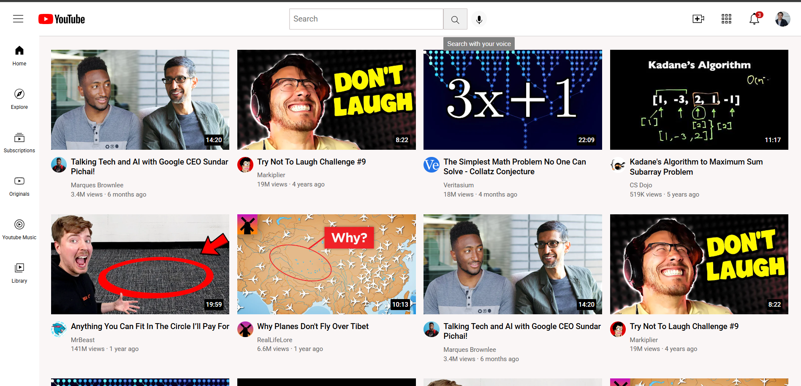

# Youtube Clone
This project uses core concepts of html and css such as grids, flexbox, position property and nested divs.
Youtube tutorial followed-https://youtu.be/G3e-cpL7ofc?si=YN-XBzBqjqxE9_l2
